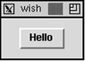

# 23  TK基本原理
## 23.1	TK中的Hello,World!

我们的第一个Tk脚本非常简单。它创建了一个按钮，当你点击它时，就向标准输出设备打印“Hello,World!”。在按钮控件上方是一个由窗口管理器提供的标题栏，本例中在X视窗系统中是*twm*。

### 23.1.1	例23-1 “Hello,World!”Tk程序

    #!/usr/local/bin/wish
    button .hello -text Hello \
       -command {puts stdout "Hello, World!"}
    pack .hello -padx 20 -pady 10

第一行标识了脚本的解释器：


    #!/usr/local/bin/wish

如果此脚本象其它NUIX命令文件那样被调用，则这个特殊的行是必要的，第2节描述了如何设置脚本于不同的平台上。
	在这个脚本中有两个TCL命令：一个用来创建按钮，一个用来使其在显示上可见。button命令创建一个按钮的实例：

	
    button .hello -text Hello \
        -command {puts stdout "Hello, World!"}
    => .hello

    
按钮的名字是.hello。按钮上的标签是Hello，与此按钮相关联的命令是：
puts stdout "Hello, World!"
pack命令将按钮映射到屏幕上。并提供了一些堆叠参数，所以在按钮周围有空间。


    pack .hello -padx 20 -pady 10

当你将这两个命令键入wish中时，当button命令给出时，你不会看到任何东西。然而，在pack命令之后，你将会看到空的主窗口将会收缩到足以容纳按钮和其添充空隙（padding）。包装器的行为在第24和第25章进行深入的讨论。
	Tk使用一种基本对象的系统来创建和命令控件。与每一种小控件（如按钮）相关联的是一个用于创建此种类别控件实例的命令。当小控件被创建时，一个作用在这个控件实例上的一个新的TCL命令就定义了。例23-1创建了一个名为.hello的按钮，并且我们可以使用其名字作为一个TCL命令来操纵此按钮。例如，我们可以使用此按钮高亮几次：

    .hello flash
或者，我们可以运行与此按钮相关联的命令：
    
    .hello invoke
    => Hello, World!
  Tk有控件类和实例，但是它并不是完全面向对象的。不可能去对一个控件类派生子类并继承。相反，Tk，提供了非常灵活的控件，可以通过多种方式调节其外观。资源数据库可以存储被许多控件共享的配置信息，并且新的类也可以被引入到组资源中。控件行为通过使用分缓绑定的绑定标签得到共享。Tk使用部件（composition）来组装共享行为和属性的控件。

## 23.2	Tk小控件的命名
按钮实例名字.hello中的句点是必需的。Tk使用了一种可以反映出控件所在层次的命名系统。层次的根就是应用程序的主窗口，其名字就是一个简单的点（也就是.）。这与UNIX系统中的目录命名习惯很相似，其跟目录名为/，/也用来分隔文件名的组成部分。Tk以同样的方式使用句点。主窗口的每一个子窗口控件以象.foo这样来命名。.foo的一个子控件将是.foo.bar，等等。正如文件系统中目录可以作为其它文件和目录的容器一样，Tk窗口层次使用框架控件作为其它控件和框架的容器。
  

构成Tk路径的每一部分必须以小写字母或数字开头。显然也不能包含句点。小写字母是为了避免与以大写字母开头的资源类名冲突。一个资源名可以包含Tk路径组成部分和Tk控件类别，并使用大小写来区分它们。第31章详细描述了资源。

  *	用变量存储控件名。*

Tk命名系统有一个缺点。如果你的界面变化足够多以至导致某些控件改变了他们在控件层次中的位置。在这种情况下，它们可能需要改变其名字。你可以通过使用变量来保存重要控件的名字这种方式与这个程序麻烦相隔离。使用一个变量的引用而不是控件的路径名以便你需要改变什么，或者你想不其它的界面是得用你的代码。控件创建命令返回控件的名字：

    set b [button .hello -text "Hello" -command {puts "Hello!"}]

你可以将$b当作命令来操作按钮：
    
    $b configure -background green
