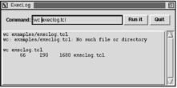
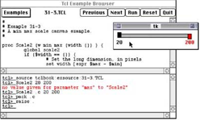
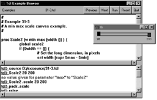
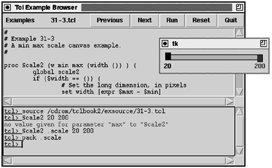

# 24	TK例子
本章通过一系列较短的子来介绍Tk。ExecLog在后台运行一个程序并显示其输出。浏览器的例子从书中显示TCL例子。Tcl Shell例子让你键入TCL命令并在一从此从解释器中执行。  

Tk提供了一种快速有效的方式产生来用户界面。在本章我们通过一系列小例子让你对你能做什么有一个感性的认识。这里掩盖了一些细节并在后面进行详细的描述。特别地，pack布器管理器在第25间涵盖，事件绑定在第29间讨论。Tk控件会在后面的章节中进行详细的讨论。


## 24.1	ExecLog
我们的第一个例子提供了一个用exec命令运行另一个程序的简单用户界面。此界面包括两个按钮（Run it和Quit）一个用于输入命令的entry控件，一个用于记录程序运行结果的文本控件。此脚本在一个管道中运行这个程序，并使用fileevent命令来等待输出。此结构使程序在执行时用户界面仍然保持响应。比如你可以运行make，并使结果保存在log中。完整的例子先给出，其中的命令在后面详细的讨论。

24.1.1	例24-1使用exec记录一个程序的输出 

 


 
```
#!/usr/local/bin/wish
# execlog - run a program with exec and log the output
# Set window title
wm title . ExecLog

# Create a frame for buttons and entry.

frame .top -borderwidth 10
pack .top -side top -fill x

# Create the command buttons.

button .top.quit -text Quit -command exit
set but [button .top.run -text "Run it" -command Run]
pack .top.quit .top.run -side right

# Create a labeled entry for the command

label .top.l -text Command: -padx 0
entry .top.cmd -width 20 -relief sunken \
   -textvariable command
pack .top.l -side left
pack .top.cmd -side left -fill x -expand true

# Set up key binding equivalents to the buttons

bind .top.cmd <Return> Run
bind .top.cmd <Control-c> Stop
focus .top.cmd

# Create a text widget to log the output

frame .t
set log [text .t.log -width 80 -height 10 \
   -borderwidth 2 -relief raised -setgrid true \
   -yscrollcommand {.t.scroll set}]
scrollbar .t.scroll -command {.t.log yview}
pack .t.scroll -side right -fill y
pack .t.log -side left -fill both -expand true
pack .t -side top -fill both -expand true

# Run the program and arrange to read its input

proc Run {} {
   global command input log but
   if [catch {open "|$command |& cat"} input] {
      $log insert end $input\n
   } else {
      fileevent $input readable Log
      $log insert end $command\n
      $but config -text Stop -command Stop
   }
}

# Read and log output from the program

proc Log {} {
   global input log
   if [eof $input] {
      Stop
   } else {
      gets $input line
      $log insert end $line\n
      $log see end
   }
}

# Stop the program and fix up the button

proc Stop {} {
   global input but
   catch {close $input}
   $but config -text "Run it" -command Run
}
```


### 24.1.2	窗口标题
第一个命令设置出现在由窗口管理器实现的标题栏。记住那个点（也就是.）就是主窗口的名字：
	
	wm title . ExecLog
wm命令与窗口管理器交互。窗口管理器就是让你打开、关闭、调节窗口大小的程序。它为窗口实现标题栏，可能也有一些用来关闭或调节大小的小按钮。不同的窗口管理器有完全不同的外表；此图显示了来自X窗口管理器twm的标题栏。

### 24.1.3	按钮的框架
创建一个框架用来装出现在界面顶部的控件。此框架有一个为控件周围提供一些空间的边界：
	
	frame .top -borderwidth 10
框架位于主窗口的顶部。默认的堆叠边是顶部，所以这里-side top是多余的，但是使用是为了清晰化。-fill x堆叠选项使框架将主窗口整个宽填满：

	pack .top -side top -fill x


### 24.1.4	命令按钮
创建了两个按钮：一个用来运行命令，另一个用来退出程序。它们的名字.top.quit和.top.run暗示它们是.top框架的子控件。这个影响pack命令，它默认将控件放置在父控件中：

```
button .top.quit -text Quit -command exit
set but [button .top.run -text "Run it" \
   -command Run]
pack .top.quit .top.run -side right
```


### 24.1.5	标签与Entry
标签和entry也作为.top框架的子控件创建。标签创建时在X方向没有填充空间，以便可以放置在后面的entry控件。Entry控件的大小根据字符来确定。Relief属性给予entry控件一些外观使它在显示上分开来。Entry控件的内容关联到TCL变量command上：

```
label .top.l -text Command: -padx 0
entry .top.cmd -width 20 -relief sunken \
   -textvariable command

```


标签和entry控件停靠在.top框架内部的左边。Entry控件的另外停靠参数允许它扩展其停靠空间并在显示上填充其额外的空间。停靠空间和显示空间的区别在339页第25章中讨论：

```
pack .top.l -side left
pack .top.cmd -side left -fill x -expand true
```


### 24.1.6	按键绑定与焦点
Entry控件的按键绑定提供了激活应用程序功能的另外一种方式。Bind命令将TCL命令与一个指定控件的事件关联起来。当用户在键盘上按回车键时，<Return>事件会被触发。当Control键已经按下时，字母c被键入时<Control-c>事件被产生。为使事件到达entry控件.top.cmd，必须将输入焦点给这个控件。默认情况下，当用鼠标左键点击它时就得到焦点。对于焦点跟随鼠标模式的用户来说显示使用focus命令是非常有益的。当鼠标在主窗口上时，用户可以向entry中打字：

```
bind .top.cmd <Return> Run
bind .top.cmd <Control-c> Stop
focus .top.cmd
```


### 24.1.7	可调大小文本和滚动条
创建一个文本控件并连同一个滚动条停靠到一个主框架中。文本控件的宽和高分别用字符和行数来指定。文本的setgrid属性是打开的。这限制其大小调节以便使整数行、平均大小的字符能被显示。
在Tk中，滚动条是一个单独的控件，它可以使用和这里相同的设置连到不同的控件上。当文本控件被修改时，文本的yscrollcommand更新滚动条的显示，且当用户操纵滚动行时，滚动条的command滚动与其关联的控件：

```
frame .t
set log [text .t.log -width 80 -height 10 \
   -borderwidth 2 -relief raised -setgrid true\
   -yscrollcommand {.t.scroll set}]
scrollbar .t.scroll -command {.t.log yview}
pack .t.scroll -side right -fill y
pack .t.log -side left -fill both -expand true
pack .t -side top -fill both -expand true
```

创建一个Tk控件的副作用是创建了一个操作此控件的新的TCL命令。此TCL命令与控件的路径名相同。在此脚本中，文本控件命令，也就是.t.log，在许多地方需要。可是，将一个重要控件的路径名存到一个变量中是一个好主意，因为如果你重新组织用户界面，路径名可以改变。这样做的缺点是你必须在过程内部要用global声明此变量。为了证明这种方式此例中的变量log就是用于这个目的。

### 24.1.8	Run过程
Run过程开始在命令entry中指定的程序。因为entry的textvariable属性，此值在全局command命令中可以得到，命令在管道中运行以便它在后台运行。Open命令参数的前导符|表示创建一个管道。Catch命令作为非法命令输入的保护。变量input设置成错误消息或正常的open返回的文件描述符。程序像这样开始：

	if [catch {open "|$command |& cat"} input] {

***从管道中捕获错误***

管道通过cat程序从命令转移错误输出。如果你不像这里使用cat，当管道关闭时管道中的错误会输出弹出一个错误消息。在本例中，令人尴尬的是如何区分程序产生的错误和由于Stop过程实现的方式所产生的错误。不但如此某些程序间隔正常和错误输出，而且你可能想按顺序查看错误输出而不是在最后一下子查看。
	如果管道成功打开，则使用fileevent命令设置一个回调函数。当管道产生输出时，脚本可以从中读出数据。Log注册为当管道可读时被调用的过程：
	
	fileevent $input readable Log

Command（或错误消息）被插入到log中。这个通过使用文本控件的名字来实现，名字以一个TCL命令存储在log变量中。命令的值被追加到log，并加了一个新行以便其输出可以出现在下一行。

	$log insert end $command\n

文本控件的insert函数带有两个参数：一个标记和一个在此标记上要插入的字串。符号标记end代表文本控件内容的末尾。
	运行按钮在程序开始后变成停止按钮。这个避免界面的混乱，也证明了Tk界面的动态特性。再次，因为这个按钮在脚本中几个不同的地方使用，其路径名已经被存储在变量中but：

	but config -text Stop -command Stop


### 24.1.9	Log过程
当管道中有数据可读或达到文件末尾时，Log过程就被激活。此条件首先被检查，且Stop过程被调用来进行清理。否则，一行数据被读取并插入到log中。文本控件的see操作用来将文本的视图定位以使新行对用户可见：

```
if [eof $input] {
   Stop
} else {
   gets $input line
   $log insert end $line\n
   $log see end
}
```

### 24.1.10	Stop过程
Stop过程通过关闭管道来终止程序。Close用一个catch进行包装。这个可以制止当进程上的管道过早地关闭时产生的错误。最后，按钮被恢复到其运行状态以便用户可以运行另一个命令：

	catch {close $input}ee
	$but config -text "Run it" -command Run
在多数情况下，关闭管道等同于杀死任务。在UNIX中，这个将导致下一次向其标准输出写操作时发送一个SIGPIPE信号到程序。没有一个杀死进程的内嵌方式，但是你可以exec UNIX的kill程序。Pid命令返回管道中进程的ID：

```
foreach pid [pid $input] {
   catch {exec kill $pid}
}

```

如果你需要对另一个进程更复杂的控制，你应该看一下在Explring Expect(Don Libes, O'Reilly & Associates, Inc., 1995)中描述的TCL的expect扩展。Expect提供了对交互式程序的强有力的控制。你可以写发送输入到交互式程序并对其输出进行模式匹配的TCL脚本。Expect被设计为自动使用交互式应用为目的的程序。

### 24.1.11	跨平台讨论
这个脚本可以在UNIX和Windows上运行，但是不能运行在Macintosh上因为那没有exec命令。另一个问题是取消任务的<Control-c>的绑定。这是类UNIX的，但Windows用户指望<Escape>来取消一项任务，Macontosh用户指望<Command-period>。Platform_CancelEvent定义了一个虚拟事件、<<Cancel>>，Stop绑定其上：

24.1.12	例24-2一个指定平台的取消事件

```
proc Platform_CancelEvent {} {
   global tcl_platform
   switch $tcl_platform(platform) {
      unix {
         event add <<Cancel>> <Control-c>
      }
      windows {
         event add <<Cancel>> <Escape>
      }
      macintosh {
         event add <<Cancel>> <Command-period>
      }
   }
}
bind .top.entry <<Cancel>> Stop
```

Tk也已经也定义了虚拟事件。event命令和虚拟事件在446页中描述。

## 24.2	浏览器的例子
例24-3是出现在本书中的示例代码的一个浏览器。基本思想是提供一个选择例子的菜单和一个显示例子的文本窗口。在你能使用这个例子之前，你需要修改它来设置好包含本书所有例子的exsource目录的正确位置。第389页的例24-4用一个测试例子的shell来扩展此浏览器。

### 24.2.1	例24-3本书中的一个代码示例游览器


```
#!/usr/local/bin/wish
#  Browser for the Tcl and Tk examples in the book.

# browse(dir) is the directory containing all the tcl files
# Please edit to match your system configuration.

switch $tcl_platform(platform) {
   "unix" {set browse(dir) /cdrom/tclbook2/exsource}
   "windows" {set browse(dir) D:/exsource}
   "macintosh" {set browse(dir) /tclbook2/exsource}
}

wm minsize . 30 5
wm title . "Tcl Example Browser"

# Create a row of buttons along the top

set f [frame .menubar]
pack $f -fill x
button $f.quit -text Quit -command exit
button $f.next -text Next -command Next
button $f.prev -text Previous -command Previous

# The Run and Reset buttons use EvalEcho that
# is defined by the Tcl shell in Example 24–4 on page 389

button $f.load -text Run -command Run
button $f.reset -text Reset -command Reset
pack $f.quit $f.reset $f.load $f.next $f.prev -side right

# A label identifies the current example

label $f.label -textvariable browse(current)
pack $f.label -side right -fill x -expand true

# Create the menubutton and menu
menubutton $f.ex -text Examples -menu $f.ex.m
pack $f.ex -side left
set m [menu $f.ex.m]

# Create the text to display the example
# Scrolled_Text is defined in Example 33–1 on page 500

set browse(text) [Scrolled_Text .body \
   -width 80 -height 10\
   -setgrid true]
pack .body -fill both -expand true

# Look through the example files for their ID number.

foreach f [lsort -dictionary [glob [file join $browse(dir) *]]] {
   if [catch {open $f} in] {
      puts stderr "Cannot open $f: $in"
      continue
   }
   while {[gets $in line] >= 0} {
      if [regexp {^# Example ([0-9]+)-([0-9]+)} $line \
             x chap ex] {
         lappend examples($chap) $ex
         lappend browse(list) $f
         # Read example title
         gets $in line
         set title($chap-$ex) [string trim $line "# "]
         set file($chap-$ex) $f
         close $in
         break
      }
   }
}

# Create two levels of cascaded menus.
# The first level divides up the chapters into chunks.
# The second level has an entry for each example.

option add *Menu.tearOff 0
set limit 8
set c 0; set i 0
foreach chap [lsort -integer [array names examples]] {
   if {$i == 0} {
      $m add cascade -label "Chapter $chap..." \
         -menu $m.$c
      set sub1 [menu $m.$c]
      incr c
   }
   set i [expr ($i +1) % $limit]
   $sub1 add cascade -label "Chapter $chap" -menu $sub1.sub$i
   set sub2 [menu $sub1.sub$i]
   foreach ex [lsort -integer $examples($chap)] {
      $sub2 add command -label "$chap-$ex $title($chap-$ex)" \
         -command [list Browse $file($chap-$ex)]
   }
}

# Display a specified file. The label is updated to
# reflect what is displayed, and the text is left
# in a read-only mode after the example is inserted.

proc Browse { file } {
   global browse
   set browse(current) [file tail $file]
   set browse(curix) [lsearch $browse(list) $file]
   set t $browse(text)
   $t config -state normal
   $t delete 1.0 end
   if [catch {open $file} in] {
      $t insert end $in
   } else {
      $t insert end [read $in]
      close $in
   }
   $t config -state disabled
}

# Browse the next and previous files in the list

set browse(curix) -1
proc Next {} {
   global browse
   if {$browse(curix) < [llength $browse(list)] - 1} {
      incr browse(curix)
   }
   Browse [lindex $browse(list) $browse(curix)]
}
proc Previous {} {
   global browse
   if {$browse(curix) > 0} {
      incr browse(curix) -1
   }
   Browse [lindex $browse(list) $browse(curix)]
}

# Run the example in the shell

proc Run {} {
   global browse
   EvalEcho [list source \
      [file join $browse(dir) $browse(current)]]
}

# Reset the slave in the eval server

proc Reset {} {
   EvalEcho reset
}

```



### 24.2.2	关于调节窗口大小的更多信息
本例中使用wm minisize命令来对窗口的最小尺寸进行约束。参数指定了最小的宽度和高度。这些值可以有两种方式解释。默认情况下它们是象素值。然而，如果有一个内部控件已经激活了布局网格（geometry gridding），则维度就是那个控件的网络单元数。在这种情况下，文本控件用其setgrid属性来激活其布局网络功能，所以窗口的最小尺寸也得到设置以使文本窗口至少有30个字符宽、5行高：

	wm minsize . 30 5

在早期的Tk版本，TK3.6，网络也激活了交互式窗口大小调节功能。在Tk4.0及以后，交互式大小调节功能默认情况下是激活的。

### 24.2.3	操纵全局状态
本例中使用browse数据收集其全局变量。这使得在过程中引用状态变得非常简单，因为只有数组需要声明为全局。当应用程序随着时间增长、新特性增加时，global命令不必调整。这种方式也在于强调什么变量是重要的。此browse数组保存着例子目录（dir），文件显示控件的路径名（text）、当前文件名（current）。list和curix元素用来实现Next和Previous过程。

### 24.2.4	通过文件查找？
浏览器通过搜索文件系统来决定它能显示什么。tcl_platform(platform)变量用来在不同的平台上选择不同的示例目录。你可能需要编辑在线的例子来匹配你的系统。本例使用glob来查找在exsource目录中的所有文件。file join命令用来以独立于系统平台的方式创建文件名模式。glob命令的结果显示进行排序以便菜单项为正确的顺序。每个文件用gets读取一行，然后用regexp扫描关键字。这里将循环重列出来作为参考：

```
foreach f [lsort -dictionary [glob -directory $browse(dir) *]] {
   if {[catch {open $f} in]} {
      puts stderr "Cannot open $f: $in"
      continue
   }
   while {[gets $in line] >= 0} {
      if {[regexp {^# Example ([0-9]+)-([0-9]+)} $line \
             x chap ex]} {
         lappend examples($chap) $ex
         lappend browse(list) $f
         # Read example title
         gets $in line
         set title($chap-$ex) [string trim $line "# "]
         set file($chap-$ex) $f
         close $in
         break
      }
   }
}

```
例子文件都包含像下面的行：	

	# Example 1-1
	# The Hello, World! program
regexp用模式的([0-9]+)-([0-9]+)部分找出例子编号，并分配给chap和ex变量。整个匹配分配给x变量，这部分我们不感兴趣。一旦找到例子的编号，就读取下一行得到例子的描述。在foreach循环的最后examples数组拥有了为每一章定义的元素，每一个元素的值是那个章节例子的列表。

### 24.2.5	层叠式菜单
example数组中的值用来创建层叠式菜单结构。首先创建一个用于弹出主菜单的菜单按钮。它用menu属性与主菜单关联起来。为使菜单正常工作，它必须是菜单按钮的子控件：


```
menubutton $f.ex -text Examples -menu $f.ex.m
set m [menu $f.ex.m]
```

有太多的章节要放到一个菜单中。主菜单有一个为每8章组成的组有一个层叠项。每一个子菜单为其组中的每一章有一个层叠项，子菜单被定义为他们父菜单的子控件。注意菜单项与按钮的不一样。它们的文本用-lable选项来定义，而不是-text。除了这个，它们更像按钮。第30章详细描述了菜单。这里代码重列出来：

```
set limit 8 ; set c 0 ; set i 0
foreach key [lsort -integer [array names examples]] {
   if {$i == 0} {
      $m add cascade -label "Chapter $key..." \
         -menu $m.$c
      set sub1 [menu $m.$c]
      incr c
   }
   set i [expr {($i +1) % $limit}]
   $sub1 add cascade -label "Chapter $key" -menu $sub1.sub$i
   set sub2 [menu $sub1.sub$i]
   foreach ex [lsort -integer $examples($key)] {
      $sub2 add command -label "$key-$ex $title($key-$ex)" \
         -command [list Browse $file($key-$ex)]
   }
}
```

### 24.2.6	只读文本控件
Browse过程非常简单。它将browse(current)设置成文件名。这样就改变了主标签，因为主标签的textvariable属性关联到这个变量。文本控件的state属性要处理，以便在文本插入后控件的文本只读。在插入文本之前你必须将state设置为normal；否则，insert不起作用。这里是一些Browse过程中的几个命令：

```
global browse
set browse(current) [file tail $file]
$t config -state normal
$t insert end [read $in]
$t config -state disabled
```

## 24.3	一个TCL Shell
本节用一人简单的TCL外壳程序示范一下文本控件。此程序使用一个文本控件来提示命令显示结果。使用第2个TCL解释器来运行你所键入的命令。这种双解释器结构已经被内嵌在Windows和Maciontosh版本的wish的控制台程序中。Jeff Hobbs写的TkCon应用程序是一个更加精妙的控制台程序，它有很多支持交互式TCL应用的特性：  
http://tkcon.sourceforge.net/

例24-4同样用来使用来自例24-3中的浏览器。浏览器的Run按钮运行此外壳中当前的例子。另一种选择是，让外壳在另一个进程中运行并使用send命令在单独的应用程序间互通TCL命令。这种做法在第651页的例43-2中说明。

### 24.3.1	例24-4在文本控件中的TCL外壳

```
#!/usr/local/bin/wish
# Simple evaluator. It executes Tcl in a slave interpreter

set t [Scrolled_Text .eval -width 80 -height 10]
pack .eval -fill both -expand true

# Text tags give script output, command errors, command
# results, and the prompt a different appearance

$t tag configure prompt -underline true
$t tag configure result -foreground purple
$t tag configure error -foreground red
$t tag configure output -foreground blue

# Insert the prompt and initialize the limit mark

set eval(prompt) "tcl> "
$t insert insert $eval(prompt) prompt
$t mark set limit insert
$t mark gravity limit left
focus $t
set eval(text) $t

# Key bindings that limit input and eval things. The break in
# the bindings skips the default Text binding for the event.

bind $t <Return> {EvalTypein ; break}
bind $t <BackSpace> {
   if {[%W tag nextrange sel 1.0 end] != ""} {
      %W delete sel.first sel.last
   } elseif {[%W compare insert > limit]} {
      %W delete insert-1c
      %W see insert
   }
   break
}
bind $t <Key> {
   if [%W compare insert < limit] {
      %W mark set insert end
   }
}

# Evaluate everything between limit and end as a Tcl command

proc EvalTypein {} {
   global eval
   $eval(text) insert insert \n
   set command [$eval(text) get limit end]
   if [info complete $command] {
      $eval(text) mark set limit insert
      Eval $command
   }
}

# Echo the command and evaluate it

proc EvalEcho {command} {
   global eval
   $eval(text) mark set insert end
   $eval(text) insert insert $command\n
   Eval $command
}

# Evaluate a command and display its result

proc Eval {command} {
   global eval
   $eval(text) mark set insert end
   if [catch {$eval(slave) eval $command} result] {
      $eval(text) insert insert $result error
   } else {
      $eval(text) insert insert $result result
   }
   if {[$eval(text) compare insert != "insert linestart"]} {
      $eval(text) insert insert \n
   }
   $eval(text) insert insert $eval(prompt) prompt
   $eval(text) see insert
   $eval(text) mark set limit insert
   return
}
# Create and initialize the slave interpreter

proc SlaveInit {slave} {
   interp create $slave
   load {} Tk $slave
   interp alias $slave reset {} ResetAlias $slave
   interp alias $slave puts {} PutsAlias $slave
   return $slave
}

# The reset alias deletes the slave and starts a new one

proc ResetAlias {slave} {
   interp delete $slave
   SlaveInit $slave
}

# The puts alias puts stdout and stderr into the text widget

proc PutsAlias {slave args} {
   if {[llength $args] > 3} {
      error "invalid arguments"
   }
   set newline "\n"
   if {[string match "-nonewline" [lindex $args 0]]} {
      set newline ""
      set args [lreplace $args 0 0]
   }
   if {[llength $args] == 1} {
      set chan stdout
      set string [lindex $args 0]$newline
   } else {
      set chan [lindex $args 0]
      set string [lindex $args 1]$newline
   }
   if [regexp (stdout|stderr) $chan] {
      global eval
      $eval(text) mark gravity limit right
      $eval(text) insert limit $string output
      $eval(text) see limit
      $eval(text) mark gravity limit left
   } else {
      puts -nonewline $chan $string
   }
}
set eval(slave) [SlaveInit shell]
```

### 24.3.2	本文标记、标签和绑定
外壳使用文本标记和一些其它绑定来保证用户只能在文本控件末尾输入文本。标记（mark）表示在插入或删除字符时所更新的文本中的位置。limit标记跟踪只读区域与可编辑区域的边界。insert标记是光标显示的地方。end标记总是文本的末尾。EvalTypein过程着眼于在limit和end间的所有文本看其是不是一个完整的TCL命令。如果是的话，它将在从解释器中激活此命令。
	键绑定来检测insert标记在哪里并在用户试图在limit标记前输入文本时将其返弹到end。puts设置右向引力于limit，所以当程序输出插入到limit右边时标记也跟随着推进。否则，limit上的左向引力表示用户在limit右边输入时标记不移动。
	文本标签（tag）用来给不同的区域的文本以不同的外观。标签应用于一段文本。标签在脚本开始时配置，当文本插入时应用。
	第36章详细描述了文本控件。

### 24.3.3	多解释器
SlaveInit过程创建另一个解释器来运行命令。这样能阻止与实现外壳的过程和变量的冲突。最初，从解释器只对TCL命令有访问权。load命令加载了Tk命令，并为从解释器创建一个新的顶层窗口“.”。第20章描述了如何在其它框架中嵌入从窗口。
shell解释器并不是以-save标志创建的，所以它可以做任何事。比如，如果你键入exit，它将使整个应用程序退出。SlaveInit过程安装了一个别名reset，它只是删除从解释器并创建一个新的。你可以在外壳中工作一会后用这个来作清理工作。第19章详细描述了interp命令。

### 24.3.4	本土外观和感觉
当你在不同平台上运行Tk脚本时，它会使用本地按钮、菜单和滚动条。文本和entry控件会被调节以给应用程序本土的外观和感觉。下面的屏幕截图显示了组合浏览器和外壳在Macintosh、Windows和UNIX上的外观。




 
 
 


