# 25 Pack布局管理器

## 25.1	向某一方向pack

下面的例子创建了两个框架并向主窗口的顶部挤压（不恰当）。上面的框架.one不大且主窗口的的显示经过其每一个边。子控件按照顺序挤压到指定的边上，所以.one是在顶端。四个可能的边是：顶、右边、下边和左边。默认是顶端。

### 25.1.1	例25-1两个主框架pack在主窗口内部

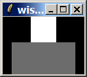

``` 
# Make the main window black
. config -bg black
# Create and pack two frames
frame .one -width 40 -height 40 -bg white
frame .two -width 100 -height 50 -bg grey50
pack .one .two -side top
```

### 25.1.2	收缩框架和pack传递

前面的例子中，主窗口收缩为刚好能容下其两个子控件大小。多数情况下这是我们想要的行为。如果不是的话，则你可以用pack propagate命令将其关闭。将这个应用到父框架中，父框架将不会调节自己去适应其子控件：

### 25.1.3	例25-2关闭几何传递

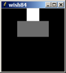

```
. config -bg black
frame .one -width 40 -height 40 -bg white
frame .two -width 100 -height 50 -bg grey50
pack propagate . false
pack .one .two -side top
```


## 25.2	水平和垂直堆叠

通常，你在一个框架中使用水平或垂直堆叠。如果混用方向，如左和上，则效果可能并不是你希望的那样。相反，你应该引入更多的框架来将一组控件pack到不同的方向的堆叠中。例如，假设我们想在迄今为止的例子中上边的框架上放一排按钮：

### 25.2.1	例25-3垂直堆叠中的水平堆叠

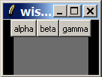

```
. config -bg black
frame .one -bg white
frame .two -width 100 -height 50 -bg grey50
# Create a row of buttons
foreach b {alpha beta gamma} {
   button .one.$b -text $b
   pack .one.$b -side left
}
pack .one .two -side top
```

### 25.2.2	例25-4垂直堆叠和水平堆叠的嵌套

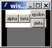

```
. config -bg black
frame .one -bg white
frame .two -width 100 -height 50 -bg grey50
foreach b {alpha beta} {
   button .one.$b -text $b
   pack .one.$b -side left
}
# Create a frame for two more buttons
frame .one.right
foreach b {delta epsilon} {
   button .one.right.$b -text $b
   pack .one.right.$b -side bottom
}
pack .one.right -side right
pack .one .two -side top
```


你可以通过引入嵌套框架并在水平和垂直堆叠间转换来组建更复杂的排列。在每一个框架的内部或者使用-side left和-side right，或者使用-side top或-side bottom的组合pack所有子控件。
例25-4将.one.gamma按钮用垂直堆叠方向的两个按钮.one.right.delta和.one.right.epsilon代替。它们被pack到.one.right的底部，所以第一个（指delta）被挤到底部。
框架.one.right被pack到右边，在前一个例子中，按钮.one.gamma被pack到底部。尽管两者之间的差别，在.one框架中它们最终被pack到相对其它两个控件而言相同的位置。下一节解释一下为什么。

## 25.3	空穴模型

pack算法基于用于框架中可用空间的空穴模型。比如，当主wish窗口创建时，主框架是空的，有一个可以用来放控件的空间或说空穴/洞。关于pack空穴的主要规则是一个控件占用空穴的整侧边。为了证明这一点，向主框架中pack 3个控件。前两个在底边，第三个在右边：

### 25.3.1	例25-5混合底部和右边堆叠


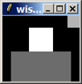

```
. config -bg black
# pack two frames on the bottom.
frame .one -width 100 -height 50 -bg grey50
frame .two -width 40 -height 40 -bg white
pack .one .two -side bottom
# pack another frame to the right
frame .three -width 20 -height 20 -bg grey75
pack .three -side right
```

当我们用-side left或-side right向主窗口中pack第三个框架时，新框架将位于空穴内部，此空穴就位于已经pack到底部的两个框架的上面。此框架并不会像你所期望的那样出现在已有框架的右边。这是因为.two框架虽然在显示上并没有填满整边，但实际上却占用了正在pack的空穴的整个底部。  
你能说出此例之后，正在pack的空穴在哪里吗？它位于框架.three的左边，它是朝右边pack的最后一个框架，并位于框架.two的上边，框架.two是向底边pack的最后一个框架。这就解释了前面的两个例子中为什么当.one.gamma向左边pack而.one.right向右边pack却没有什么差别。然而，这会影响到当再有另一个控件pack到这两个配置中时所发生的影响。在运行例25-3和例25-4后试运行下面的命令并比较其差别。[*]  
	[*]答案：在例25-3后新的按钮位于所有按钮的右边。在例25-4后新的按钮位于.one.beta和.one.right之间。

```
button .one.omega -text omega
pack .one.omega -side right
```


每一个packing的父控件都有其空穴，这就是为什么引用嵌套框架会有所帮助。如果你在一个给定的框架中使用水平或垂直排列，你可以更容易在模仿packer的在你脑中的行为！

## 25.4	Pack空间和显示空间

packer在排列控件时区分packing空间和显示空间。显示空间就是控件为了描绘自身而可求的区域。packing空间是packer允许放置控件的区域。因为几何上的限制。控件可能会分配比显示自己所需的更多（或更少）的packing空间。如果有的话，额外的空间总是靠着控件被pack到空穴的一边。

### 25.4.1	–fill选项

packing中的-fill选项会使一个控件将其显示空间填充到其分配到的packing空间中。控件可以在X或Y方向或两者同时都能得到填充。默认不进行填充，这就是为什么以前的例子中主窗口总有黑色背景显示出来。


### 25.4.2	例25-6将额外packing空间填充为显示空间

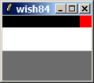

``` 
. config -bg black
frame .one -width 100 -height 50 -bg grey50
frame .two -width 40 -height 40 -bg white
# Pack with fill enabled
pack .one .two -side bottom -fill x
frame .three -width 20 -height 20 -bg red
pack .three -side right -fill x

```


除了所有的框架都指定了-fill x选项，本例同例25-5一样。.two框架进行了填充而.three框架没有。这是因为填充并没有扩充到packing的空穴。实际上，此例之后packing空穴就是以黑色显示的那部分。看待这个的另一个角度是.two框架已经分配了packing空穴的整个底部，所以它的填充可以扩充框架来占用那部分空间。框架.three仅被分配了右边，所以X方向的填充并没有起任何作用。
填充的另一个应用是一个在每一端都有按钮中间有空间的的菜单条。装按钮的框架被pack到顶部。按钮被pack到菜单条的左边和右边。没有填充的话，菜单条会收缩到足以容纳所有的按钮，按钮也会挤到一起。当在X方向填充时，菜单条会填满显示区域的上边：


### 25.4.3	例25-7在菜单条中使用水平填充

```
frame .menubar -bg white
frame .body -width 150 -height 50 -bg grey50
# Create buttons at either end of the menubar
foreach b {alpha beta} {
   button .menubar.$b -text $b
}
pack .menubar.alpha -side left
pack .menubar.beta -side right
# Let the menu bar fill along the top
pack .menubar -side top -fill x
pack .body
```


### 25.4.4	使用-ipadx和-ipady进行内部填充

得到更多填充空间的另一种方法是使用-ipadx和-ipady选项。它们可以分别在X和Y方向上要求更多的显示空间。由于其它方面的约束你的请求可能不被满足，但是通常你可以用此法给控件以更多的显示空间。下一个例子除了添加了一些内部填
充外和前面的一样：

### 25.4.5	例25-8内部填充（-ipady）的效果

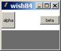

```
# Create and pack two frames
frame .menubar -bg white
frame .body -width 150 -height 50 -bg grey50
# Create buttons at either end of the menubar
foreach b {alpha beta} {
   button .menubar.$b -text $b
}
pack .menubar.alpha -side left -ipady 10
pack .menubar.beta -side right -ipadx 10
# Let the menu bar fill along the top
pack .menubar -side top -fill x -ipady 5
pack .body
```


按钮algha比较高beta比较宽是因为内部填充。框架有内部填充，它可以减少packing空穴的可用空间，所以，框架.menubar显示范围超过按钮的上边和下边。
	某些控件有些属性可以导致更多的显示空间。比如，很难区分一个宽是50没有内部填充的框架和一个宽为40 packing选项-ipadx 5的框架。packer会为总宽度为50的框架两边额外的5个像素的显示空间。
	按钮也有自己的可以给它们更多显示空间的-padx和-pady选项。这个由按钮提供的填充选项用来保持文本远离按钮的边缘。下面的例子说明了这个差别。按钮的-ancher e选项尽量将文本向右边靠。第617页的例40-5提供了这些选项的另一个比较：

### 25.4.6	例25-9按钮填充 VS packer填充

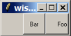

```
# Foo has internal padding from the packer
button .foo -text Foo -anchor e -padx 0 -pady 0
pack .foo -side right -ipadx 10 -ipady 10
# Bar has its own padding
button .bar -text Bar -anchor e -pady 10 -padx 10
pack .bar -side right -ipadx 0 -ipady 0
```


在任何情况下，你可以指定使用任何一种Tk可以识别的屏幕距离表示的任意数量的填充空间。简单的数值解释为像素。你可以在字母i、m、c或p后面跟一个数字，它们分别解释为英寸、毫米、厘米和像素。

### 25.4.7	使用-padx和-pady进行外部填充

packer能提供额外的填料空间，此填料空间分配为不能被填充的packing空间。此空间是控件边界的外面，控件用来实现3D浮雕效果。第614页中的例40-2展示了不同的浮雕效果。用一个额外的框架和一些填料可以到到默认按钮的外观：

### 25.4.8	例25-10默认按钮的外观

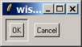

```
config -borderwidth 10
# OK is the default button
frame .ok -borderwidth 2 -relief sunken
button .ok.b -text OK
pack .ok.b -padx 5 -pady 5
# Cancel is not
button .cancel -text Cancel
pack .ok .cancel -side left -padx 5 -pady 5
```

按钮.ok.b即使用了-fill both选项但看起来也是一样的。子控件不会填充packer提供的外部填充空间。
	例25-10画出了默认按钮的外观。Tk8.0经按钮加了一个-default属性，它可以在当前平台上给默认按钮正确的外观。它看来有虚像UNIX，但是在Windows和平共处五项原则Macintosh上是不一样的。
	Tk8.4增加了由一个两个屏幕距离组成的列表所指定的不对称填充空间的能力。比如，下面为在左边和右边增加了5个像素点，3个在上面，6个在下面：

```
pack .ok .cancel -side left -padx 5 -pady {3 6}
```


## 25.5	大小调节和’-expand’

-expand true选项令一个控件将其pack空间扩展到packing空穴中无人要求的空间中。例25-6中，可以在顶部的小框架上使用这个来将其显示扩展到整个顶部，即使此框架被pack到右边。当你有一个大小可调窗口时更一般的情况会发生。当用户使窗口变大时，控件必须被告知去利用额外的空间。假设在一个带有滚动条的框架中你有一个像列文本、列表框或画布的主控件。框架必须被告知要扩展到其父控件（比如，主窗口）的额外空间中且主控件（如，画布）也得被告知要扩展到其父框架中。第378页中的例24-1就是这样做的。
下面我们可以来研究一下窗口变大小发生了什么。下面一个例子像400页中的例25-7一样开始，但是主窗口的大小增加了：

### 25.5.1	例25-11没有expand选项的大小调节

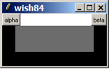

```
# Make the main window black
. config -bg black
# Create and pack two frames
frame .menubar -bg white
frame .body -width 150 -height 50 -bg grey50
# Create buttons at either end of the menubar
foreach b {alpha beta} {
   button .menubar.$b -text $b
}
pack .menubar.alpha -side left
pack .menubar.beta -side right
# Let the menu bar fill along the top
pack .menubar -side top -fill x
pack .body
# Resize the main window to be bigger
wm geometry . 200x100
# Allow interactive resizing
wm minsize . 100 50
```

要求新空间的唯一控件是.menubar，因为其-fill x packing选项。框架.body需要被正确地pack：

### 25.5.2	例25-12打开expand选项开关的大小调节

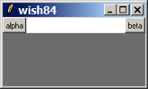

```
# Use all of Example 25–11 then repack .body	
pack .body -expand true -fill both
```

如果在同一个父控件中有多于一个控件允许扩展，则packer会让它们按比例分享额外空间。这可能并不是在我们已有的例子中你想要的效果。比如，.menubar并不适合扩展。

### 25.5.3	例25-13多于一个expand的控件

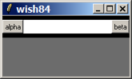

```
#Use all of Example 25–11 then repack .menubar and .body
pack .menubar -expand true -fill x
pack .body -expand true -fill both
```

## 25.6	停靠（Anchoring）

如果控件的packing空间比显示空间多，你可以使用-anchor选项将其放置在其packing空间中。默认的停靠位置是中间。其它的选项指向符合一个罗盘形：n、ne、e、se、s、sw、w和nw。

### 25.6.1	例25-14停靠试验的设置

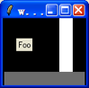

```
# Make the main window black
. config -bg black
# Create two frames to hold open the cavity
frame .prop -bg white -height 80 -width 20
frame .base -width 120 -height 20 -bg grey50
pack .base -side bottom
# Float a label and the prop in the cavity
label .foo -text Foo
pack .prop .foo -side right -expand true
```


框架.base被pack在底部。然后，框架.prop和标签.foo以扩展不填充方式被pack到右边。扩展给并没有将控件挤到右边，而是在X方向上分别给它们一半的额外空间。默认的中间停靠方式导致了如图所示的位置。下面的例子展示了停靠位置的一些差别：

## 25.6.2	例25-15非中心停靠的效果

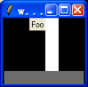

```
. config -bg black
# Create two frames to hold open the cavity
frame .prop -bg white -height 80 -width 20
frame .base -width 120 -height 20 -bg grey50
pack .base -side bottom
# Float the label and prop
# Change their position with anchors
label .foo -text Foo
pack .prop -side right -expand true -anchor sw
pack .foo -side right -expand true -anchor ne
```


标签在每一边都有空间，所以对于每一个不同的停靠所得位置也不相同。框架.prop仅在X方向的有空间，所以它只能被移动三个不同的位置：左、中和右。其它的停靠w、nw和sw都会得到左边的位置。中间停靠center、n和s得到在中位置。e、se和ne都得到右边位置。
如果你想看一下所有的情况，键入下面的命令将不同的packing anchors动起来。update idletasks会强制任何挂起的显示操作。after 500会使脚本等待500毫秒。

### 25.6.3	例25-16让packing的停靠动起来

```
foreach anchor {center n ne e se s sw w nw center} {
   pack .foo .prop -anchor $anchor
   # Update the display
   update idletasks
   # Wait half a second
   after 500
}
```

## 25.7	Pack的顺序

packer会对pack到一个框架中的子控件维护一个顺序。默认情况下，每一个新控件都被追加到pack顺序的最后。最明显的效果就是最先pack的子控件最靠近其pack的边缘。你可以使用-before和-after选项来控制pack的顺序，也可以将已经pack的控件重新进行组织。

### 25.7.1	例25-17控制packing的顺序

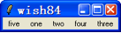
 
```
# Create five labels in order
foreach label {one two three four five} {
   label .$label -text $label
   pack .$label -side left -padx 5
}
# ShuffleUp moves a widget to the beginning of the order
proc ShuffleUp { parent child } {
   set first [lindex [pack slaves $parent] 0]
   pack $child -in $parent -before $first
}
# ShuffleDown moves a widget to the end of the order
proc ShuffleDown { parent child } {
   pack $child -in $parent
}
ShuffleUp . .five
ShuffleDown . .three
```


### 25.7.2	反省

pack slaves命令以pack顺序返回子控件的列表。ShuffleUp过程用这个来找出第一个子控件以便可以在它前因插入其它子控件。ShuffleDown过程比较简单因为默认是追加到pack顺序的最后。
	当一个控件被pack后，它保持着自己所有的已设置的pack参数。如果你想检查某控件当前的pack参数，用pack info命令。

```
pack info .five
=> -in . -anchor center -expand 0 -fill none -ipadx 0 \
     -ipady 0 -padx 0 -pady 0 -side left
```

### 25.7.3	先pack滚动条

* pack的顺序当然也决定了当窗口变小时发生的事情。如果窗口变得足够小packer会剪裁在pack顺序后面的子控件。这就是为什么，当你pack一个滚动条和一个文件控件到一个框架中时，你必须先pack滚动条的原因。否则，当窗口变得得小时文本控件占用了所有的空间，滚动条就会被剪裁。

## 25.8	选择pack的父控件

一般来说，在本章中所有的例子，一个控件都是pack到其父控件中的。通常，也可能将一个控件pack到任意其父控件的派生/子控件中。例如，控件.a.b可以pack到.a、.a.c或.a.d.e.f中。-in选项可以使你指定一个可选择的pack父控件。这其中一种动机就是引入的用来进行排列的框架可以导致重要控件名字的混乱。在第398页中例25-4中，按钮的名字像.one.alpha和.one.right.delta是不一致的。这里将此例以另一种可替代的方法实现，对按钮的名字进行了简化并产生相同的结果：

### 25.8.1	例25-18 pack到其它相关联的控件内部

```
# Create and pack two frames
frame .one -bg white
frame .two -width 100 -height 50 -bg grey50
# Create a row of buttons
foreach b {alpha beta} {
   button .$b -text $b
   pack .$b -in .one -side left
}
# Create a frame for two more buttons
frame .one.right
foreach b {delta epsilon} {
   button .$b -text $b
   pack .$b -in .one.right -side bottom
}
pack .one.right -side right
pack .one .two -side top
```


当你这样做的时候，记住创建控件的顺序是非常重要的。要先创建框架，然后再创建控件。窗口堆叠的顺序会导致后面创建的窗口遮盖/模糊/淡化先创建的窗口。下面就是一个常见的错误，因为框架遮盖了按钮：

```
button .a -text hello
frame .b
pack .a -in .b
pack .b
```

如果你不能避免这个问题的场景，则你可以使用raise命令来进行修正。堆叠顺序会在409页讨论。

```
raise .a

```

## 25.9	Unpacking一个控件

pack forget命令从pack顺序中移除。控件就不会被给制，所以也不可见。如果你unpack一个父控件框架，则只内部的pack结构还是保持的，但是所有在其中的控件都变为非绘制的。当你想在界面上抑制某些特性时，unpack一个控件非常有用的。你可以创建控件所有部分，并只是延迟pack它们直到用户要求显示它们为止。则你可以动态地对它们pack和unpack。

## 25.10	Pack总结

关于packer要记住以下几条：

* 在一个框架中垂直（-side top或-side botton）或水平（-side left和-side right）pack。只有很少量的不同pack方向混合不以你想的方式工作。增加框架来组建更复杂的结构。
* 默认情况下，packer会将控件放到其父框架中，父框架必须在子控件pack前被创建。
* 如果你将控件放到其亲戚控件中，记住要先创建框架以使框架在pack到其中的控件的下面。
* 默认情况下，packer会忽略pack进控件的框架的-with和-height属性。它将框架收缩到刚好为控件边界的宽度，并将控件放置其中。用-pack propagate来关闭收缩-包裹行为。
* packer区别pack空间和显示空间。控件的显示可能不会占据分配给它的全部pack空间。
* -fill选项使用显示在X或Y方向，或同时填满pack空间。
* -expand true选项可以使pack空间扩展到pack空穴中未要求的任何空间。如果在同一个框架中有多个控件要扩展，则它们共享额外的空间。
* -ipadx和-ipady选项在边界内分配更多的显示空间，如果可能的话。
* -padx和-pady选项在边界外分配更多的pack空间，如果可能的话。控件从来不填充这个空间。这些值可以用两个值的列表所指定以便得到非对称的填充。


### 25.10.1	pack命令

表25-1总结了pack命令。表25-2总结了控件的pack选项。这些都由pack configure命令来设置，当前设置由pack info命令返回。

表 25-1. pack命令

command | explain
------------ | ------ 
pack win ?win ..? ?options?             	|	同pack配置。
pack configure win ?win ...? ?options?		|   跟据选项pack一个或多个控件，在表23-2中给出。
pack forget win ?win...?    				|	unpack指定的控件
pack info win								| 返回窗口win的pack参数。
pack propagate win ?bool?					|   查询或设置有其它控件pack在其中的窗口win的几何传递，
pack slaves win								| 返回由窗口win管理的控件列表。


表 25-2. Pack 选项


command      		| explain
-------------------| --------------------
-after win			| 	pack到窗口win的后面
-anchor anchor		|	停靠：中间、n, ne, e, se, s, sw, w, or nw.
-before win			|	pack到窗口win的前面
-expand boolean		|	控制扩展到未要求的pack空穴。
-fill style			|	控制pack空间的填充风格：. Style: x, y, both, or none.
-in win				|	pack的窗口win中。
-ipadx amount		| 	以屏幕单元（screen units）水平方向向内填料
-ipady amount		|	以屏幕单元（screen units）垂直方向向内填料
-padx amount		|	以屏幕单元（screen units）水平方向向外填料。可以是两个屏幕单元值的列表以便得到非对称的填充(Tk 8.4)。
-pady amount		|	类似上面，垂直方向。
-side side			|	方向: top, right, bottom, or left.



## 25.11	窗口堆叠顺序

raise和lower命令可以控件窗口的堆叠顺序。堆叠顺序控制着窗口的显示。堆叠顺序较高的窗口会覆盖堆叠顺序较低的窗口。默认情况下，新创建的窗口在堆叠顺序的最顶端以便覆盖老的窗口。考虑这个顺序：

```
button .one
frame .two
pack .one -in .two
```

如果你这样做了，就看不见按钮了。问题是框架在较高的堆叠顺序上所以覆盖了按钮。
可以用raise命令来改变堆叠顺序。

```
raise .one .two
```

这将.one只是放在.two的堆叠顺序之上。如果没有指定.two，则.one会被放到堆叠顺序的最上端。   
lower命令形式相似。带有一个参数时，放置那个窗口在堆叠顺序的最底端。否则，只是放置在低于另一个窗口的位置。  
	你可以在顶层窗口中上使用raise和lower来控制其在所有顶层窗口中的堆叠顺序。例如，如果用户请求一个已经显示了的窗口，用use使其弹出到混乱桌面的前端。决定顶端窗口的堆叠顺序要用wm stackorder命令。（参看“顶层大小，放置，修饰”）。

