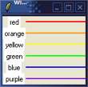

# 26 Grid布局管理器

本章探索一下grid布局管理器，它将控件放到可以自动调节大小的网格中。网络在Tk4.1中加入的。  
grid布局管理器将控件放到可变大小的行列所组成的网格中网格中。你可以指定每一个控件所占用的行列数，网格自动调整以适应它包括的所有控件。这为创建类似表格分布是非常理想的。管理器当然也有复杂的控制行列大小和动态大小调节的机制。通过引入有自己网格的子框架，你可以创建任意的布局。
  
* 不要pack和grid到同一个管理器控件。  

如在第395页中讨论中的那样，你可以组合pack和grid来创建你的显示。但是对于每一个管理器控件，你只能使用pack或grid来管理其所有直接子控件。

## 26.1	基本网络


例26-1使用grid在并行两列中放置一组控件和框架。它利用了grid的相对放置特性的优点。不是指定行和列，grid命令和其参数的顺序暗含了布局。每个grid命令开始一个新行，grid命令参数中的控件顺序决定了列。在此例中，有两列，循环中每一次迭代增加一新行。grid使每一列的宽到足以容下最大的控件。小控件在单元格中居中。这就是为什么标签控件在其列中居中的原因：

### 26.1.1	例26-1一个基本的网格



```
foreach color {red orange yellow green blue purple} {
   label .l$color -text $color -bg white
   frame .f$color -background $color -width 100 -height 2
   grid .l$color .f$color
}
```



### 26.1.2	-sticky设置


如果网格单元格比其中的控件大，你可以用-stick选项来控制控件的大小和位置。-stick选项组合了-fill和-anchor选项。你指定控件贴到单元格的哪些边。你可以指定n、e、w、和s的任意组合将控件贴向单元格顶、右、左和底端。你可以将这些字母连在一起（如，news）或用空格或逗号分隔它们（如，n,e,w,s）。例26-2用-sticky w向左调整标签，-sticky ns将颜色框架拉伸到行高。


### 26.1.3	例26-2用sticky设置的网格



``` 
foreach color {red orange yellow green blue purple} {
   label .l$color -text $color -bg white
   frame .f$color -background $color -width 100 -height 2
   grid .l$color .f$color
   grid .l$color -sticky w
   grid .f$color -sticky ns
}
```


### 26.1.4	例26-3一个指定行列的网格



```
set row 0
foreach color {red orange yellow green blue purple} {
   label .l$color -text $color -bg white
   frame .f$color -background $color -width 100
   grid .l$color -row $row -column 0 -sticky w
   grid .f$color -row $row -column 1 -sticky ns
   incr row
}
```
 

### 26.1.5	用-padx和-pady进行外部填充 


你可以用-padx和-pady设置使用控件选离其网格边儿。例26-4用外部填料将标签移动使其离开左边，并使颜色条间保持一些白空间：

### 26.1.6	例26-4一个外部填充的网格



``` 
foreach color {red orange yellow green blue purple} {
   label .l$color -text $color -bg white
   frame .f$color -background $color -width 100 -height 2
   grid .l$color .f$color
   grid .l$color -sticky w -padx 3
   grid .f$color -sticky ns -pady 1
}
```


Tk8.4中增加了由两个屏幕距离组成的列表所指定的非对称填充能力。比如，-padx {0.125i 0.25i}相对于控件左边增加了1/8英寸，对于控件右边增加了1/4英寸。

### 26.1.7	用-ipadx和-ipady进行内部填充 


你可以使用内部填充来给一个控件多余其正常需要的显示空间。内部填充会增加网格的尺寸。作为对比，-sticky选项会拉伸一个控件，但不会改变网格的尺寸。例26-5用-ipady使用标签更高：

### 26.1.8	例26-5一个内部填充的网格



``` 
foreach color {red orange yellow green blue purple} {
   label .l$color -text $color -bg white
   frame .f$color -background $color -width 100 -height 2
   grid .l$color .f$color
   grid .l$color -sticky w -padx 3 -ipady 5
   grid .f$color -sticky ns -pady 1
}
]
```


### 26.1.9	一个网格中的多个控件


例26-6展示了所有可能的-sticky设置。它运用了一个网格可以放置多个控件的能力。每一个网格中放置一个大的方框框架，同时用不同的-sticky设置放置一个标签到相同的网格中。重要的是，要先创建框架以使其在标签之下。窗口堆叠会在第409页中讨论。外部填充用来使标签远离边界以使它们不会遮盖框架的脊状（-ridge）浮雕。

### 26.1.10	例26-6所有-sticky设置的组合


``` 
set index 0
foreach x {news ns ew  " " new sew wsn esn nw ne sw se n s w e} {
   frame .f$x -borderwidth 2 -relief ridge -width 40 -height 40
   grid .f$x -sticky news \
      -row [expr {$index/4}] -column [expr {$index%4}]
   label .l$x -text $x -background white
   grid .l$x -sticky $x -padx 2 -pady 2 \
      -row [expr {$index/4}] -column [expr {$index%4}]
   incr index
}
```


## 26.2	跨行和列


一个控件可以占用多个单元网格。-rowspan和-columnspan属性指示一个控件占用多少行和列。例26-7显示使用row、column、rowspan和columspan指示：

### 26.2.1	例26-7显式行和列跨距



``` 
. config -bg white
foreach color {888 999 aaa bbb ccc fff} {
   frame .$color -bg #$color -width 40 -height 40
}
grid .888 -row 0 -column 0 -columnspan 3 -sticky news
grid .999 -row 1 -column 0 -rowspan 2 -sticky news
grid .aaa -row 1 -column 1 -columnspan 2 -sticky news
grid .bbb -row 2 -column 2 -rowspan 2 -sticky news
grid .ccc -row 3 -column 0 -columnspan 2 -sticky news
grid .fff -row 2 -column 1 -sticky news
```

你也可以在grid命令中使用表示行和列布局的特殊的语法。特殊字符表示单元网格是行/列跨度的还是被跳过的。
	-表示跨列。
	^表示跨行。
	x表示跳过。
隐示的行列分配一个优点是容易对布局作修正。例26-8得到相同的布局：

###  26.2.2	例26-8网格语法行和列跨



```
. config -bg white
foreach color {888 999 aaa bbb ccc ddd fff} {
   frame .$color -bg #$color -width 40 -height 40
}
grid .888 -     -      -sticky news
grid .999 .aaa  -      -sticky news
grid ^    .fff  .bbb   -sticky news
grid .ccc -     ^      -sticky news
```

译者注：每grid为一行，后面控件的顺序为列序。

## 26.3	行和列约束


grid管理器支持整行和整列的影响大小和大小调节行为的属性。grid命令有rowconfigure和columnconfigure操作来设置和查询这些属性：

```
grid columnconfigure master col ?attributes?
grid rowconfigure master row ?attributes?
```

没有attributes时返回当前的设置。row和col指示可以是列表而非简单的索引，所以你可以一次设置几行或列。

### 26.3.1	行和列填料


-pad属性增加一行或列的尺寸。行或列的初始大小由最大的控件决定，-pad增加其尺寸。填料可以被使用-sticky属性的控件所填充。行和列填料的作用像内部填料因为其额外空间可以被控件的显示所占用。作为对比，作用在单个控件的-padx和-pady之作用像一个隔离器可以使控件远离单元网格边界。例26-9展示了这个差别。行填料增加行的高度，但在.f1上的填料使用其远离单元网格的边界。

### 26.3.2	例26-9行填充与单元格填充对比


``` 
. config -bg black
label .f1 -text left -bg #ccc
label .f2 -text right -bg #aaa
grid .f1 .f2 -sticky news        ;# no padding
grid .f1 -padx 10 -pady 10       ;# cell padding
grid rowconfigure . 0 -pad 20    ;# row padding
```

### 26.3.3	最小尺寸


-minisize属性限制一列或行为最小尺寸。如果控件需要的话行和列可以变大，但不会比最小尺寸变得更小。-minisize的一个有用之处是创建空行或列，这样比创建额外的框架更有效。

### 26.3.4	管理大小调节行为


如果主框架比网格要求的大小还大，则它会收缩到足够容纳为止。你可以用grid propagate来关闭收缩-包裹（shrink-wrap）行为。如果几何传递关闭的话，则网格会在主框架中居中。如果主框架小得不能装下网格，则网格停靠在宿主的左上角并将右下角的部分省略。  
默认情况下，当你增加框架大小时行和列大小不会调节。你可以通过为行和列指定一个大于0的-weight来使用大小调节功能生效。例26-10将一个文本控件和两个滚动条放入网格中。滚动条与文本控件间的协议在第501页中描述。文本控件在0行0列，两个方向上都能扩展。垂直滚动条在0行1列，所以只能在Y方向上增长。水平滚动条在行1列0，所以只能在X方向上增长：

### 26.3.5	例26-10 Grid一个文本控件和滚动条


``` 
text .text -yscrollcommand ".yscroll set" \
   -xscrollcommand ".xscroll set" -width 40 -height 10
scrollbar .yscroll -command ".text yview" -orient vertical
scrollbar .xscroll -command ".text xview" -orient horizontal
grid .text .yscroll -sticky news
grid .xscroll -sticky ew
grid rowconfigure . 0 -weight 1
grid columnconfigure . 0 -weight 1
```

你可以使用不同的权重来让不同的行和列以不同的速率增长。然而，还有一些需要技巧的话题，因为调节行为适用于额外的空间而不是总空间。例如，假定有4个列宽度分别为10、20、30和40，总共为100。如果主框架增长到140像素宽，则有40个额外像素。如果每一列都有权重1，则每一列都得到相同的额外空间，或10个更多的象素。现在假定列0权重为0、列1和列2权重为1，列3权重为2。列0不会增长，列1和2会得到多于10个象素，列3得到多于20个象素。多数情况下，权重为0和1最为合理。
  
* 当收缩时权重的作用会相反  

如果行或列必须收缩时，权重相反地作用。高权重的行或列会收缩的更多。比如，将不同权重相同大小的框架放入列中，当用户把窗口变大时，列中权重大的框架变大得更快。当窗口被变小是，此框架变小得更快。

### 26.3.6	统一列 


-uniform属性使得创建相同宽（或高）的列（或行）变得更容易。使用-uniform来创建一组列（或行）。属性的值可以任意（如，xyz）。所有有着相同的-uniform属性的列（或行）在同一个组中。如果它们有相同的-weight值，则它们都是同样大小的。如果一组中有一个列（或行）有个-weight是其它列（或行）的两倍，则它的大小也是两倍的。这个示例于例26-11。

### 26.3.7	例26-11 统一列宽


```
foreach x {alpha beta gamma x y z} {
   label .$x -text $x
}
.beta config -bg white
.y config -bg white
grid .alpha .beta .gamma -sticky news
grid .x .y .z -sticky news
grid columnconfigure . "0 1 2" -uniform group1 -weight 1
grid columnconfigure . 1 -weight 2
```


## 26.4	grid命令


表26-1总结了grid命令的使用。表26-2总结了使用grid configure命令设置的控件选项。

表 26-1. grid 命令

command      		| explain
-------------------| --------------------
grid bbox master ?c1 r1? ?c2 r2?			| Returns the bounding box, of the whole grid, the cell at c1, r1, or the cells from c1, r1 to c2, r2.返回整个网格、在c1r1处的单元格或从c1r1到c2r2的单元格的bounding box。
grid columnconfigure master col ?options?	| 设置查询列的配置。选项为-minsize, -weight, -pad和 -uniform
grid configure win ?win ...? ?options?		| 根据选项将一个或多个控件放入网格中，选项在表26-2中给出
grid forget win ?win...?					| 取消指定窗口的显示/绘制。
grid info win								|	返回win 的网格选项
grid location master x y					| Returns the cell column and row under the point x, y in master.返回宿主中点x,y处的单元列和行。
grid propagate master ?boolean?	 			| 	打开或关闭宿主的收缩-包裹功能
grid rowconfigure master row ?options?		| 设置或查询行的设置，选项为-minsize, -weight, -pad,和 -uniform.
grid remove slave							| 除了保留其配置外，取消slave的显示
grid size master							| 返回行列数
grid slaves win ?-row r? ?-column c?		| 返回由win管理的控件列表或指定行或列处的控件。


表 26-2. Grid控件选项

command      		| explain
-------------------| --------------------
-in win			| 放到win内部.
-column col		| 列位置.列从0开始计数
-columnspan n	| 跨n列.
-ipadx pixels	| 以屏幕/象素为单元在上X方向上控件内部填料
-ipady pixels	| 以屏幕/象素为单元在上Y方向上控件内部填料
-padx pixels	| 以屏幕/象素为单元在上X方向上控件外部填料。可能为了不对称填料的两个屏幕单元组成的列表。
-pady pixels	| 以屏幕/象素为单元在上Y方向上控件外部填料。可能为了不对称填料的两个屏幕单元组成的列
-row row		| 行位置。行数从0开始
-rowspan n		| 跨n行
-sticky how		| Positions widget next to any combination of north (n), south (s), east (e), and west (w) sides of the cell. Use {} for center.停靠控件到任意方向的组合，东(e)、南(s)、西(w)、北(n)。用{}表示居中。

