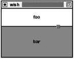

# 27	Place布局管理器

本章探索一下将控件放在屏幕上的place布局管理器。  
	place布局管理器比pack和grid简单得多。你指定窗口的精确位置和大小，或指定控件的相对位置和相对大小。这在很少情况下有用，但如果你得放置很多窗口时就会很快变得令人生厌。place的最好应用就是使用其相对约束来创建特殊目的的几何管理器。place的典型应用是调节两个相邻窗口间的边界。

## 27.1	place基础

place命令使你指定窗口的宽度和高度、窗口停靠点的X和Y位置。大小和位置可以用绝对和相对条件指定。相对指定功能更强大。例27-1用place将一个窗口居中放置于其父控件中。你可以用这个命令来放置你不想分离于顶层窗口的对话框：

### 27.1.1	例27-1用place将一个窗口居中

```
place $w -in $parent -relx 0.5 -rely 0.5 -anchor center
```
-relx和-rely指定了控件$w在$parent中停靠点的相对X和Y位置。一个相对为0的X（或Y）值对应于$parent的左（或顶）端。1对应于$parent的右（或底）边。0.5表示中间。停靠点决定了停靠在$w中的指定的某个位置。例27-1中使用了center停靠选项以使$w在$parent中居中。  
使用相对高度和宽度是基于另一个控件基础上的。例27-2中用一个窗口完全覆盖了另一个窗口。它使用窗口的默认停靠点，即就是它们的左上角（nw）：

### 27.1.2	例27-2用place覆盖一个窗口

```
place $w -in $parent -relwidth 1 -relheight 1 -x 0 -y 0
```

绝对、相对大小和位置参数是附加的（如，-with和-relwidth）。你可以通过指定两个参数来使一个窗口稍微变大或变小些。例27-3中，负数宽和高用来使一个窗口比另一个小：

### 27.1.3	例27-3组合相对和绝对大小

```
place $w -in $parent -relwidth 1 -relheight 1 -x 0 -y 0 \
   -width -4 -height -4
```
$parent没有必要真是$w的父控件。要求是$parent是$w的父控件或$w父控件的派生控件。当然，也得在相同的顶层窗口。保证当$parent可见时，$w是可见的。这些也是pack布局管理器所强加的限制。  
	也没有必要将一个控件停靠在另一个控件的内部。例27-4将一个窗口停靠在另一个兄弟控件5个象素之上之上。如果#sibling位置变化，则$w会随之移动。当你放置其它控件于可调大小窗口角或边上作装饰时这种方法很有用。当窗口大小调整时，这些装饰会自动移到位：

### 27.1.4	例27-4用place在sibling上放置窗口
```
place $w -in $sibling -relx 0.5 -y -5 -anchor s \
   -bordermode outside
```

-bordermode outside的指定使放置$w时任何$sibling的装饰性边界都被忽略。在此例中位置是相对于$sibling的外边界的。默认情况下，将边界考虑进去是便于控件在其父控件边界内停靠。  
父控件不必是框架。例27-1可以用来在文本控件中间放一个对话框。例27-4中，$sibling和$w可以都是标签控件。

## 27.2	窗格管理器

place命令的相对大小和放置参数可以用来创建定制的布局管理器。例27-5展示了一个窜格布局的管理器。两个框架，或说是窗格，放在另一个框架中。第三个小的框架表示一个用来调节两个窗格边界的把手。  
	注意：Tk8.4增加一个panedwindow控件，它可以管理任意数量的水平或垂直窗格。参看第28章可以得得如何使用panedwindow

### 27.2.1	例27-5用Pane_Create设置垂直或水平窗格


```
proc Pane_Create {f1 f2 args} {

   # Map optional arguments into array values
   set t(-orient) vertical
   set t(-percent) 0.5
   set t(-in) [winfo parent $f1]
   array set t $args

   # Keep state in an array associated with the master frame
   set master $t(-in)
   upvar #0 Pane$master pane
   array set pane [array get t]

   # Create the grip and set placement attributes that
   # will not change. A thin divider line is achieved by
   # making the two frames one pixel smaller in the
   # adjustable dimension and making the main frame black.

   set pane(1) $f1
   set pane(2) $f2
   set pane(grip) [frame $master.grip -background gray50 \
      -width 10 -height 10 -bd 1 -relief raised \
      -cursor crosshair]
   if {[string match vert* $pane(-orient)]} {
      set pane(D) Y;# Adjust boundary in Y direction
      place $pane(1) -in $master -x 0 -rely 0.0 -anchor nw \
         -relwidth 1.0 -height -1
      place $pane(2) -in $master -x 0 -rely 1.0 -anchor sw \
         -relwidth 1.0 -height -1
      place $pane(grip) -in $master -anchor c -relx 0.8
   } else {
      set pane(D) X ;# Adjust boundary in X direction
      place $pane(1) -in $master -relx 0.0 -y 0 -anchor nw \
         -relheight 1.0 -width -1
      place $pane(2) -in $master -relx 1.0 -y 0 -anchor ne \
         -relheight 1.0 -width -1
      place $pane(grip) -in $master -anchor c -rely 0.8
   }
   $master configure -background black

   # Set up bindings for resize, <Configure>, and
   # for dragging the grip.

   bind $master <Configure> [list PaneGeometry $master]
   bind $pane(grip) <ButtonPress-1> \
      [list PaneDrag $master %$pane(D)]
   bind $pane(grip) <B1-Motion> \
      [list PaneDrag $master %$pane(D)]
   bind $pane(grip) <ButtonRelease-1> \
      [list PaneStop $master]

   # Do the initial layout

   PaneGeometry $master
}
```


### 27.2.2	解析参数和维护状态

### 27.2.3	Sticky布局设置

### 27.2.4	事件绑定


### 27.2.5	管理版面


### 27.2.6	例27-6 PaneDrag调节百分比


### 27.2.7	例27-7 PaneGeometry更新版面



## 27.3	place命令

